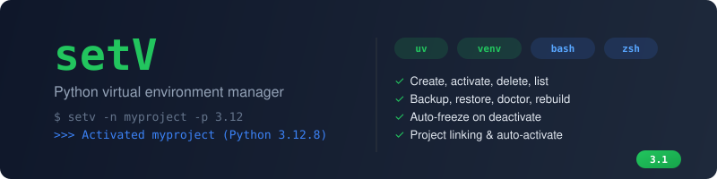

<p align="center">
  
</p>

<p align="center">
  <a href="https://github.com/savitojs/setV/blob/main/LICENSE"></a>
   <!-- x-release-please-version -->
  
  
  
  <br><br>
  A lightweight shell function that manages Python virtual environments<br>
  from a single centralized directory. Fast, portable, zero dependencies.
</p>

---

## Why setV?

Python's built-in `venv` works fine for creating environments. What it doesn't do is help you manage them. Environments end up scattered across project directories, you forget which ones exist, and when your OS upgrades Python, every single one breaks silently.

`virtualenvwrapper` solved some of this years ago, but it's heavy, pip-installed, Python-version-dependent, and hasn't kept up with modern tooling like `uv`.

**setV** is a single shell function. No pip install, no Python dependency, no virtualenv package. It sources into your shell and just works. Everything lives in `~/.virtualenvs/` so you always know where your environments are.

### What it gives you beyond venv

- **One command for everything.** Create, activate, list, delete, inspect, link, backup, restore, diagnose, and repair.
- **uv as the default backend.** Auto-detected. Environment creation goes from seconds to milliseconds. Falls back to stdlib `venv` if uv isn't installed.
- **Environments survive OS upgrades.** `setv doctor` finds broken environments after a Python version bump. `setv rebuild --all` recreates them and reinstalls all packages from auto-saved requirements.
- **Auto-freeze on every deactivate.** Packages are silently saved each time you deactivate. When something breaks, the requirements are already there.
- **Backup and restore.** `setv backup` exports every environment's metadata and packages. `setv restore` recreates them on a new machine.
- **Project linking.** Associate a directory with an environment. Drop a `.setv` file and the environment auto-activates on `cd`.
- **Throwaway environments.** `setv tmp` creates an environment that deletes itself when you deactivate.
- **Run without activating.** `setv run myenv -- pytest tests/` executes in the environment's context without touching your shell state.
- **Works in both Bash and Zsh.** Native tab completion for both. No `bashcompinit` hacks.

## Install

```sh
curl -sSL https://github.com/savitojs/setV/releases/latest/download/install.sh | bash
source ~/.bashrc   # or source ~/.zshrc
```

```sh
setv -n myproject       # create + activate
setv myproject          # activate
setv -l                 # list
setv --help             # full usage
```

### Prerequisites

- Bash 4+ or Zsh 5+
- Python 3
- curl (for installation)
- (Optional) [uv](https://github.com/astral-sh/uv) for faster environment creation

### From source

```sh
git clone https://github.com/savitojs/setV.git && cd setV && ./install.sh
```

### Uninstall

```sh
curl -sSL https://github.com/savitojs/setV/releases/latest/download/install.sh | bash -s -- --uninstall
```

Or from a local clone: `./install.sh --uninstall`

## Command reference

| Feature | Command |
|---|---|
| Create + activate | `setv -n myproject` |
| Create with Python version | `setv -n myproject -p 3.12` |
| Activate | `setv myproject` |
| List all envs | `setv -l` |
| Delete | `setv -d myproject` |
| Environment info | `setv -i myproject` |
| Link project directory | `setv link myproject` |
| Navigate to linked project | `setv cd myproject` |
| Auto-activate on cd | `setv init myproject` |
| Freeze packages | `setv freeze myproject` |
| Backup all envs | `setv backup ~/backup` |
| Restore from backup | `setv restore ~/backup` |
| Health check | `setv doctor` |
| Fix broken envs | `setv rebuild --all` |
| Throwaway env | `setv tmp` |
| Run without activating | `setv run myenv -- pytest` |
| Update setv | `setv update` |

## Doctor and rebuild

When your OS upgrades Python (e.g. 3.10 to 3.11), existing virtual environments break because they contain symlinks to the old Python binary.

```sh
$ setv doctor

ENVIRONMENT          STATUS     PYTHON             REQUIREMENTS
───────────          ──────     ──────             ────────────
myproject            OK         Python 3.12.12     saved (10 pkgs)
old-tool             BROKEN     Python 3.10 (missing) saved (5 pkgs)

$ setv rebuild --all
```

## Configuration

Set these before sourcing `setv.sh`:

| Variable | Default | Description |
|---|---|---|
| `SETV_VIRTUAL_DIR_PATH` | `~/.virtualenvs` | Directory for all environments |
| `SETV_BACKEND` | `auto` | `auto`, `uv`, or `venv` |
| `SETV_DEFAULT_PYTHON` | `python3` | Default Python binary |
| `SETV_AUTO_ACTIVATE` | `true` | Enable cd auto-activate hook |

## Credits

**setV** was originally created by [Sachin Patil (psachin)](https://gitlab.com/psachin/setV). The original project provided core virtual environment management for Bash with Python 2/3 support.

Version 3.0+ is a complete rewrite by [Savitoj Singh](https://github.com/savitojs), adding uv backend support, project linking, backup/restore, doctor/rebuild, auto-freeze, temporary environments, Zsh native completion, and a CI test suite.

- Original project: [gitlab.com/psachin/setV](https://gitlab.com/psachin/setV)
- [Why setV](https://psachin.gitlab.io/why_setv.html) by psachin
- [setV on opensource.com](https://opensource.com/article/20/1/setv-bash-function)

## License

GNU GPL v3. See [LICENSE](LICENSE).
